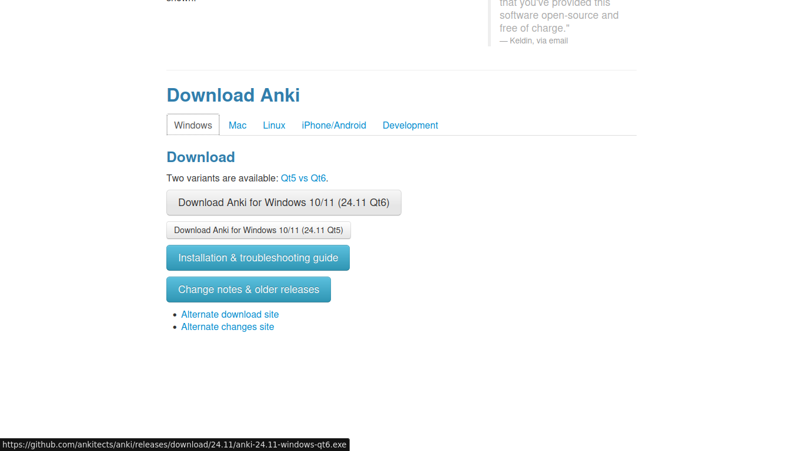
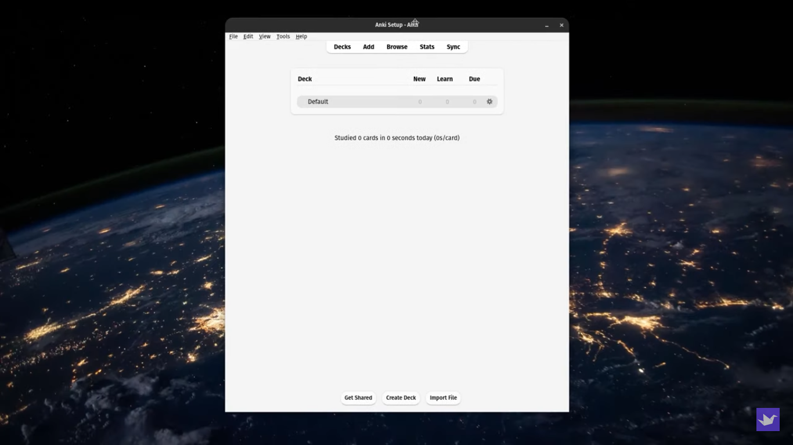
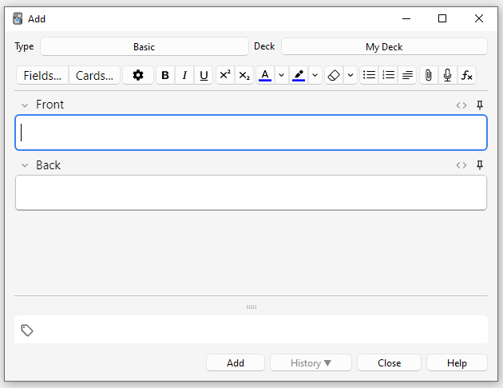

# Hướng dẫn sử dụng Anki cho việc học ngoại ngữ

Anki là phần mềm cho phép bạn học từ vựng thông qua các flashcards. Các flashcards này có thể có sẵn hoặc do bạn tự tạo. Mỗi một bộ chứa các flashcards được gọi là "Deck", mình tạm dịch là Bộ Từ Vựng. 

Các bạn nên tự tạo bộ từ vựng riêng cho mình vì mỗi người có nhu cầu học khác nhau cũng như trình độ khác nhau. Mình đã thử vài bộ từ có sẵn và đều không cảm thấy thoải mái vì có bộ thì quá dễ, có bộ lại quá khó.

## Sử dụng Anki cơ bản

### 1. Cách tải xuống, cài đặt và học bộ từ vựng

Bạn có thể tải xuống Anki tại [trang chủ của Anki](https://apps.ankiweb.net/).

Khi bấm "Download" thì nó sẽ tự chuyển xuống mục Tải xuống ở cuối trang

Sau khi tải xuống hoàn tất, bạn nhấp đúp chuột vào tệp cài đặt của phần mềm, bấm Next liên tục là xong (Nếu bạn sử dụng Windows).

Sau khi cài đặt xong bạn sẽ thấy biểu tượng Anki hiện trên Desktop. Khi mở ứng dụng lần đầu tiên bạn sẽ được yêu cầu chọn ngôn ngữ, bạn có thể để mặc định là **English**.

Để tự tạo bộ từ vựng cho mình, bạn chọn **Create Deck**. 

Nếu muốn sử dụng các bộ từ vựng có sẵn, bạn chọn **Get Shared** (Nếu bạn chọn **Get Shared** thì Anki sẽ tự động mở trình duyệt và chuyển đến kho các bộ thẻ đã được làm sẵn bởi các người dùng khác).

### 2. Tạo bộ thẻ, tạo thẻ và Import bộ thẻ khác.

#### Tạo thẻ học

Trước khi tạo thẻ học bạn cần có một bộ Deck để lưu trữ các thẻ bạn tạo. Để tạo deck, bạn chỉ cần chọn **Create Deck** và nhập tên bộ thẻ bạn muốn tạo, bấm Ok là xong

Khi bấm **Add** thì sẽ hiện lên một cửa sổ:

Ở góc trên bên trái màn hình sẽ hiện chữ **Type**, đó là kiểu thẻ của thẻ bạn muốn tạo và góc trên bên phải màn hình là **Deck**, là bộ thẻ mà bạn sẽ lưu thẻ này vào.

Ở đây Type sẽ được đặt là **Basic** và sẽ chỉ hiện 2 trường (Field) là Front và Back, nội dung nhập vào Front sẽ hiện ở mặt trước của thẻ và Back sẽ hiện ở mặt sau của thẻ.

Bấm vào **Add** để thêm thẻ mới

Điền thông tin vào thẻ. 1 thẻ ghi nhớ thường bao gồm 2 mặt:

- Front: Mặt trước của thẻ: đây là ghi nội dung truyền tải của nội cần học/ghi nhớ.
- Back: Mặt ghi câu trả lời của mặt trước.

Mỗi một thẻ từ vựng sẽ có hai mặt là mặt trước (Front) và mặt sau (Back)

Trong Anki sẽ có các Card Type (Hay "kiểu thẻ"), mỗi một kiểu thẻ sẽ bao gồm những Field khác nhau để bạn điền. Phần tiếp theo chúng ta sẽ nói thêm về các kiểu thẻ khác nhau. Ở phần này, chúng ta sẽ chỉ sử dụng kiểu thẻ Basic.

Sau khi nhập xong, các bạn có thể thêm tag cho từng thẻ nếu muốn. VD: khi xong thẻ và bạn muốn đánh dấu đây là thẻ về danh từ, có thể ghi **Danh từ**, **Từ chỉ cảm xúc** vào phần Tags để sau này có thể chọn ôn theo từng tag

Sau đó bấm Add để lưu thẻ vào trong Deck.

### Sử dụng các bộ thẻ được làm sẵn (premade decks)

Bộ thẻ được tạo sẵn giúp giảm thời gian tạo thẻ để học. Có nhiều bộ thẻ được tạo sẵn cho các chủ đề khác nhau. Bạn có thể tải trên trang [Shared Decks của Anki](https://ankiweb.net/shared/decks/).

Tìm trên tranh tìm kiếm hoặc chọn các chủ đề ở trang Shared Decks, sau đó tìm trong danh sách bộ thẻ được chia sẻ cho đến khi bạn tìm thấy tiêu đề bộ thẻ mà bạn muốn sử dụng. Bạn cũng có thể bấm vào một bộ thẻ bất kì và xem một số thẻ ví dụ. 

Sau khi đã chọn được một bộ thẻ, kéo xuống để tìm nút tải xuống màu xanh và bấm vào đó để tải bộ thẻ về. Sau khi tải xong, mở Anki và bấm vào "Import File" ở dưới màn hình chính để thêm bộ thẻ vào kho thẻ của bạn.

### Các phiên học

Sau khi tạo bộ thẻ và thêm các thẻ từ vựng (Hoặc bạn đã **Import** bộ thẻ bạn đã tải xuống trên mạng về), chúng ta có thể bắt đầu ôn tập. Bạn bấm vào bộ thẻ bạn cần học

Bấm **Study Now** để bắt đầu.

Khi card hiển thị, bạn phải tự "trả bài" cho mình về nghĩa của từ, loại từ, thường dùng trong ngữ cảnh nào, các từ liên quan hoặc word families của nó. Sau khi tự "trả bài" xong, bạn click vào "Show Answer" để xem nghĩa của từ.

Sau khi đọc "Answer", bạn đánh giá độ khó của từ đối với bản thân.

!!! info "Cách chấm điểm đơn giản"
    Bấm "Again" nếu sai hoặc không biết, nếu đúng thì bấm "Good"
    (Nếu bạn mới bắt đầu sử dụng Anki thì có thể học theo kiểu này)

Sau khi chọn mức độ khó của từ rồi thì các từ kế tiếp cứ tiếp tục hiện ra và bạn chỉ việc làm theo trình tự như trên cho đến khi hết câu hỏi và đã review lại luôn những từ khó.

Sau khi ôn tập lại các từ cũ và học xong khối lượng từ mới hàng ngày là hoàn thành một phiên học Anki.

### Một số các hướng dẫn nhanh khác

## Tìm hiểu thêm

Bạn có thể học khóa [Anki cơ bản](https://hocanki.com/ii-anki-co-ban/020-anki-co-ban/) (Không biết có phải được làm bởi AnkiVN không, nhưng có khá nhiều bài hướng dẫn miễn phí nên mọi người có thể học)

### Cài đặt Anki cho các nền tảng khác (MacOS, Linux, Android, iOS)

- [Hướng dẫn học tiếng Anh qua Flashcard trên AnkiDroid chi tiết](https://www.thegioididong.com/game-app/huong-dan-hoc-tieng-anh-qua-flashcard-tren-ankidroid-chi-tiet-1378805)

### Video

- [Một video hướng dẫn nhanh cách sử dụng, học, thêm thẻ và tối ưu quá trình học trong Anki](https://www.youtube.com/watch?v=Om_1NECh8sQ) - Video nhà làm
- [Video hướng dẫn của Đat Nguyễn trên Youtube](https://youtu.be/M9-qwsHyBrc)

### Bài viết

- [Cách mình học 500 từ mỗi ngày và tăng từ 7+ lên 9+ điểm thi tiếng anh THPTQG trong khoảng 2 tháng](https://spiderum.com/bai-dang/Cach-minh-hoc-500-tu-moi-ngay-va-tang-tu-7-len-9-diem-thi-tieng-anh-THPTQG-trong-khoang-2-thang-k8Pd390eNrS3)
- [Cảm nhận sử dụng của một người dùng trên Spiderum](https://spiderum.com/bai-dang/Tron-1-nam-su-dung-Anki-de-nho-moi-thu-va-mot-so-ghi-chu-8pz)

